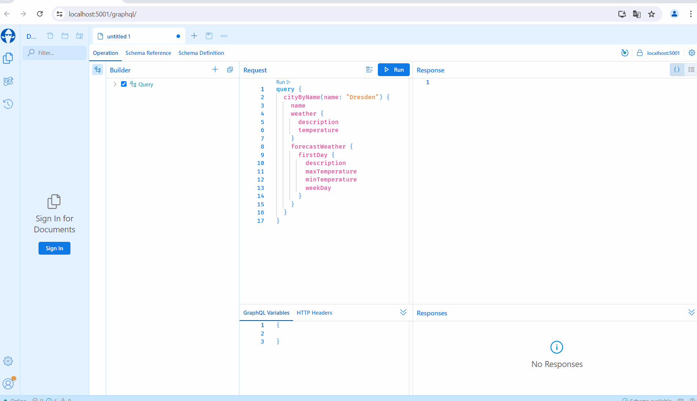
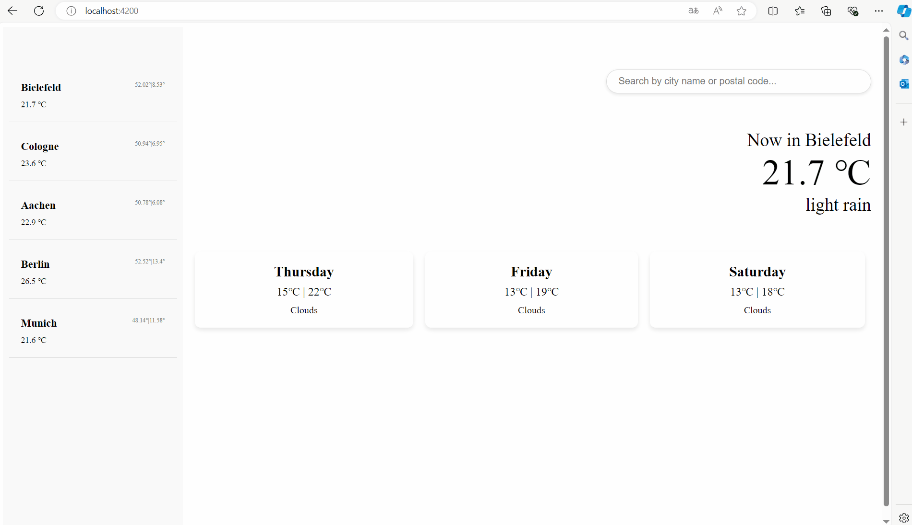
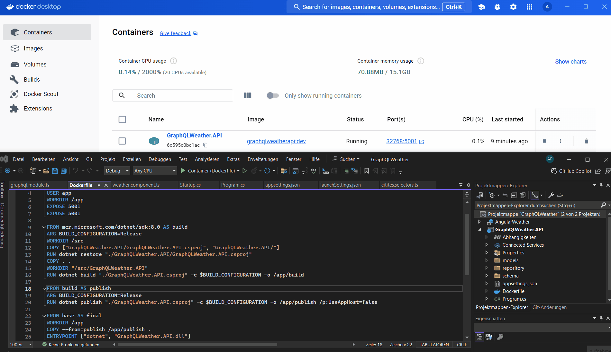

# GraphQL and Angular for Weatherdata App

### Backend:

- The project was developed in Visual Studio with .NET 8;
- A GraphQL server was implemented using HotChocolate. Three query types were created: GetCities, GetCityByName and GetCityByPostalCode, which return information about cities and their weather;
- The class CityType has an ExtendObjectType CityExtensions, which creates additional properties in the form of weather classes and makes requests to openweathermap.org;
- The weather response is received in JSON format and deserialized. The temperature was rounded, and the date was converted to the day of the week. The weather forecast data was given for the next 5 days every 3 hours. This data was grouped by dates, with the minimum and maximum temperatures determined. The most frequently occurring weather description within each group was used.The processed information is stored in the classes CurrentWeather and ForecastWeather;
- The project utilized the Repository Pattern (ICityRepository) to abstract data access and ensure that the implementation can be easily replaced;
- The project incorporates logging to track and record application activities and errors such as exception handling to manage invalid operations. There is a validation for incorrect input: checking that the index is within the required range, as well as validating the entered city name (Regular Expression Definition, Check for Empty or Whitespace-Only String, Check Length Constraints, Check for Invalid Characters, Check for Excessive Repeating Characters).

### Frontend

- The project uses the Angular framework;
- In the search bar on the right, you can enter either the postal code or the city name to search for the weather;
- On the left, there is a column of cities with their current temperatures, which will be developed into a list of favorite cities. When a search is performed, the current weather and the weather for the next three days are displayed;
- For the cities component, the NgRx Library was used, which means state, actions, selectors, reducers, and effects were created.

### Additional Requirements

- The backend was containerized with Docker for easy deployment in Microsoft Azure Cloud
